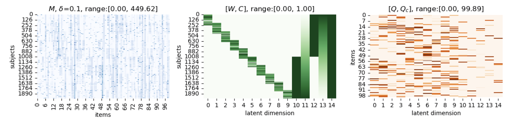
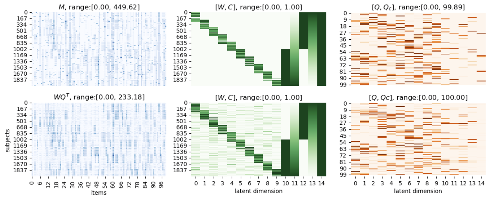
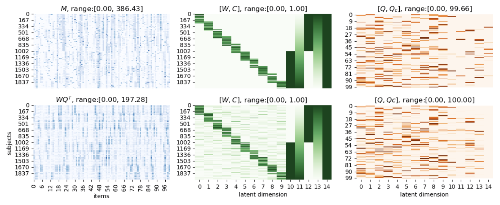
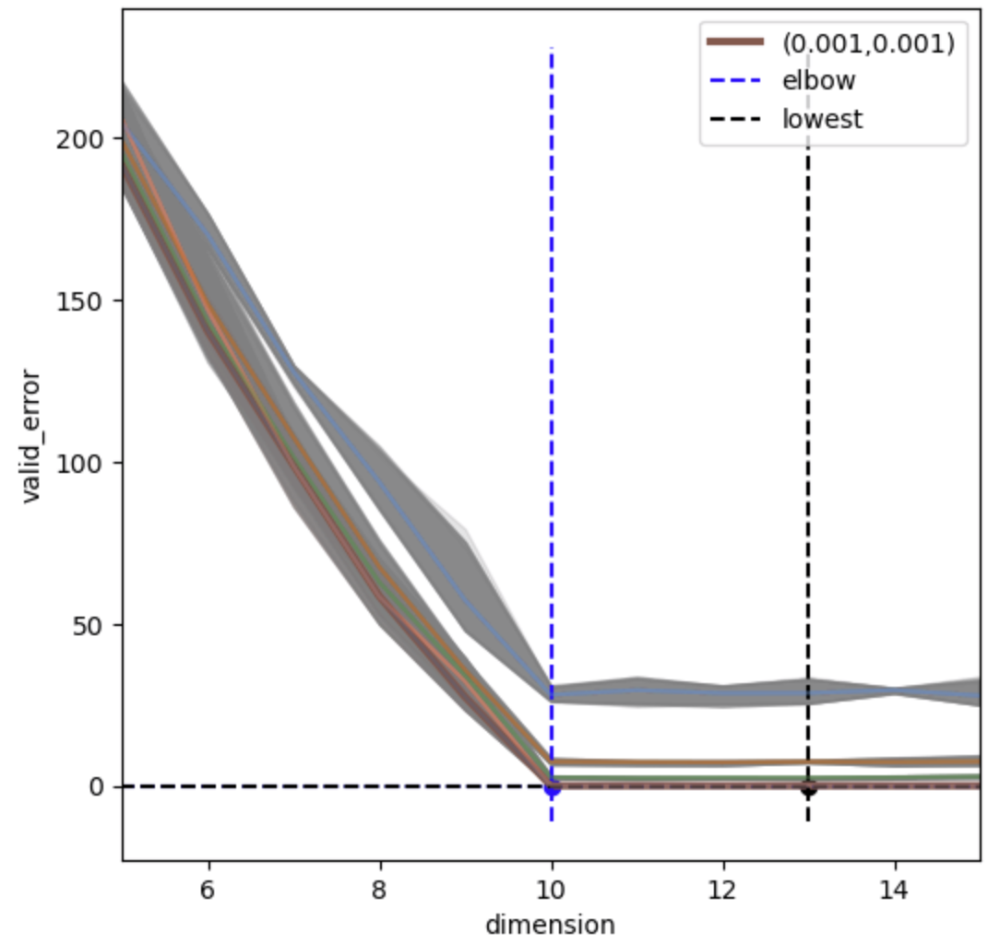
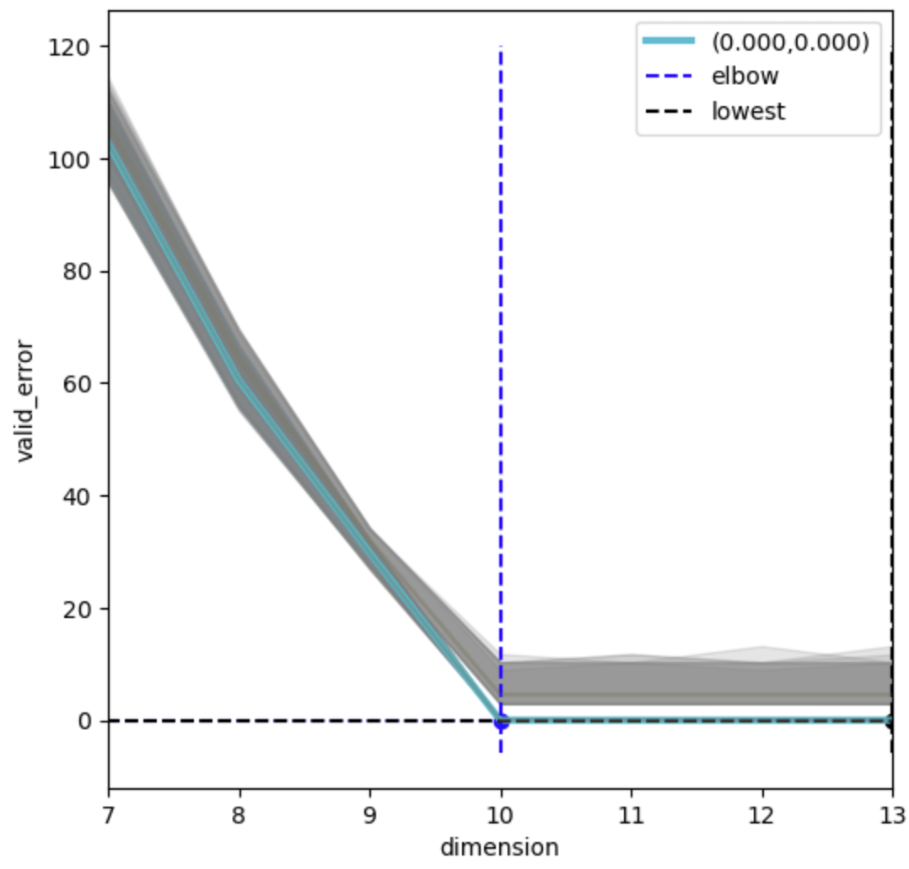
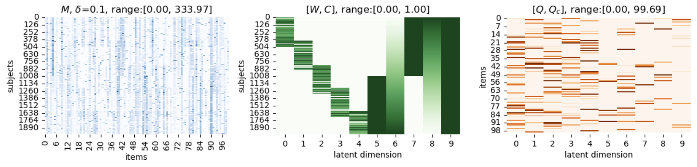
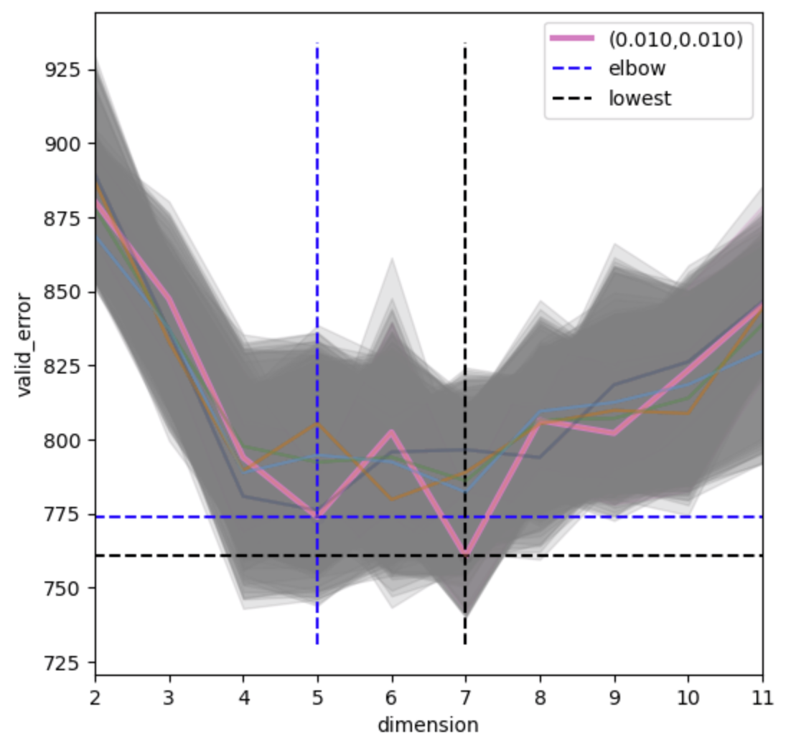
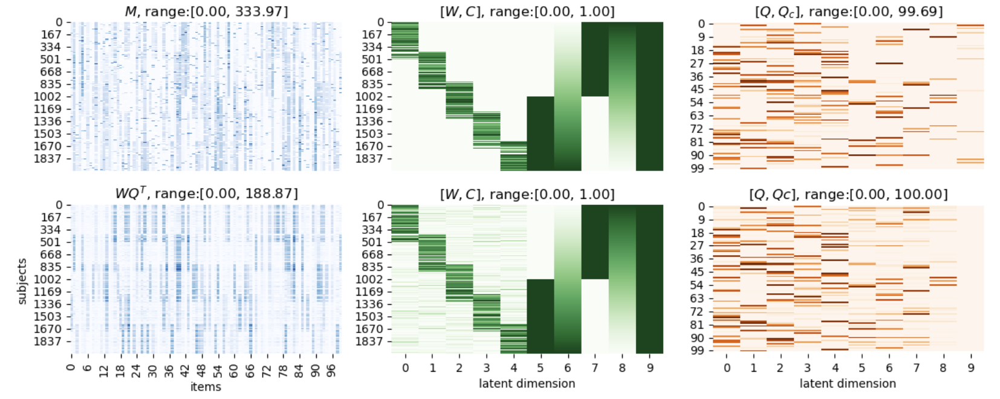

[TOC]

# Examples

## Synthetic example with confounds

---

Using the `simulation` function in `utils.generate_synthetic`, we can generate a synthetic example with auxiliary variables (confounds) containing categorical and continuous variables (subjects' sex and age information).

```python
from src.data_class import matrix_class
from src.ICQF import ICQF
from utils.generate_synthetic import simulation, show_synthetic_result

true_W, true_Q, confound_raw, M_clean, M, _ = simulation(2000, 100, noise=True, confound=True)
```

- The density of the data matrix can be set via `density`, the default os 0.3 (30%)
- We can set the noise magnitude via `delta` ranging from 0 (no noise) to 1, the default is 0.1.



Instead of `None` in the **[Quick example]('./README.md')**, `confound_raw` is a $2000 \times 2$ matrix storing the categorical (first column) and continuous (second column) confounds:

```python
print(np.around(confound_raw,3))
[[0.    0.   ]
 [0.    0.001]
 [0.    0.001]
 ...
 [1.    0.999]
 [1.    0.999]
 [1.    1.   ]]
```

> The function `simulation` generates both the `confound_raw` and the matrix $C$ based on the following rules:
>
> - If the $j^{\text{th}}$ column `confound_raw`$_{[:,j]}$ is categorical, we convert it to indicator columns for each value (we have two categories in this example). The transformed columns are `10` and `12` respectively in the middle panel of the above figure. 
> - If it is continuous, we first rescale it into $[0, 1]$ (where 0 and 1 are the minimum and maximum in the dataset), and replace it with two new columns, $C_{[:,j]}$ and $1 - C_{[:,j]}$. This mirroring procedure ensures that both directions of the confounding variables are considered (e.g. answer patterns more common the younger or the older the participants are). the transformed columns are `11` and `13` respectively in the middle panel of the above figure.
>
> Lastly, we incorporate a vector of ones into $C$ to facilitate intercept modeling of dataset wide answer patterns, which is the `14` column in the middle panel of the above figure.

Similarly, we construct the corresponding `matrix_class` object storing the data.

```python
MF_data = matrix_class(M=M, confound_raw=confound_raw)
```

Then we setup the ICQF model:

```python
clf = ICQF(n_components=10,
           W_beta=0.1,
           Q_beta=0.1,
           W_upperbd=(True, 1.0),
           Q_upperbd=(True, 100),
           M_upperbd=(True, np.max(MF_data.M))
          )
```

and fit and transform the data matrix:

```
MF_data, loss = clf.fit_transform(MF_data)
```

We then compare with the ground-truth results qualitatively:

```
show_synthetic_result(MF_data, true_W, true_Q)
```



## Synthetic example with missing entries

---

In this example, we generate another example with missing entries. We can set the missing ratio via `missing_ratio`:

```python
true_W, true_Q, confound_raw, M_clean, M, nan_mask = simulation(2000, 100, noise=True, confound=True, missing_ratio=0.05)
```

We include `nan_mask` to the `matrix_class`:

```
MF_data = matrix_class(M=M, confound_raw=confound_raw, nan_mask=nan_mask)
```

Setup the ICQF model:

```python
clf = ICQF(n_components=10,
           W_beta=0.01,
           Q_beta=0.01,
           W_upperbd=(True, 1.0),
           M_upperbd=(True, np.max(MF_data.M)),
           Q_upperbd=(True, 100)
          )
```

and fit, transform and visualize the results:

```python
MF_data, loss = clf.fit_transform(MF_data)
show_synthetic_result(MF_data, true_W, true_Q)
```



## Configuration detection

---

Very often the latent dimension is not know a-priori, not to mention the strength of regularizers. For users who wish to explore the dataset automatically, the function `detect_dimension` can be utilized to estimate the optimal, data-driven configuration via **B**lockwise **C**ross-**V**alidation (**BCV**).

### Example 1

---

We generate a simple example

```python
true_W, true_Q, _, M_clean, M, _ = simulation(200, 100)
MF_data = matrix_class(M=M)
```

In certain scenarios, the upper bound of `Q` may be unknown. Therefore, we solely impose an upper bound constraint on `W` to enhance interpretability. Specifically, we set the upper bound of `W` to $1$, aligning it with the scale of confounding factors for the sake of conciseness.

We setup the ICQF model:

```python
clf = ICQF(n_components=None,
           W_upperbd=(True, 1.0),
           Q_upperbd=(False, 0),
           M_upperbd=(True, np.max(MF_data.M))
          )
```

We then use the `detect_dimension` function

```python
optimal_MF_data, optimal_stat, embed_stat_list = clf.detect_dimension(MF_data)
```

and obtain the full profile `embed_stat_list`



Here the optimal configuration detected is dimension $=10$, $\beta_W = 0.001$, $\beta_Q = 0.001$.

### Example 2

---

If you have a more specific range of dimensions for detection, you can specify the detection range via `dimension_list`.

The range of regularization strength ($\beta_W$ and $\beta_Q$) can also be set for different resolution of grid-search.

To detect optimal configuration, we use the `detect_dimension` function. 

```python
optimal_MF_data, optimal_stat, embed_stat_list = clf.detect_dimension(MF_data, dimension_list=[7,8,9,10,11,12,13], W_beta_list=[0.0, 0.01, 0.1], repeat=2, nfold=10, random_fold=False, separate_beta=False)
```

When dealing with data that contains noise and missing entries, the identification of the elbow in the validation error curve can often be challenging or ambiguous. To ensure robustness, we recommend to set `random_fold=False`, even though it may require additional time. Increasing `repeat` is also helpful.

ICQF also supports separate estimation of regularization strength $\beta_W$ and $\beta_Q$ by setting `separate_beta=False`. However, it will add one extra dimension in the hyper-parameter search and you may expect a longer time for optimal configuration detection.



## Synthetic example with confounds, noise & missing variables

---

(This example may take some time 旦~)

This example simulates the situation in which

- we have 5% missing entries in the tabular data (`missing_ratio=0.05`)
- we have auxiliary variables (subjects' age and sex information) (`confound=True`)
- the intrinsic latent dimension is unknown (we set it to be 5)
- possibly noise presents in the question response ($M$)
- more realistic samples size in questionnaires (2000 subjects, 100 question items)

We generate the synthetic example by the following configuration:

```python
true_W, true_Q, confound_raw, M_clean, M, nan_mask = simulation(2000, 100, ndict=5, overlap=100,  noise=True, confound=True, missing_ratio=0.05)
```



Similarly, we construct the dataclass:

```python
MF_data = matrix_class(M=M, nan_mask=nan_mask, confound_raw=confound_raw)
```

and setup the ICQF model:

```python
clf = ICQF(n_components=None,
           W_upperbd=(True, 1.0),
           M_upperbd=(True, np.max(MF_data.M)),
           Q_upperbd=(False, 0))
MF_data, loss = clf.fit_transform(MF_data)
```

As the latent dimension is unknown, we set `n_components=None` and the ICQF algorithm will automatically estimate the optimal configuration (latent dimension and the regularization strength).

After the detection, the profile of the blockwise cross-validation will be visualized:



The elbows of the reconstruction error indicate that the optimal configuration would be 

- latent dimension = 5
- $L_1$ regularization strength for $W$ and $Q$ : (0.01, 0.01)

The corresponding factorization result would be:



