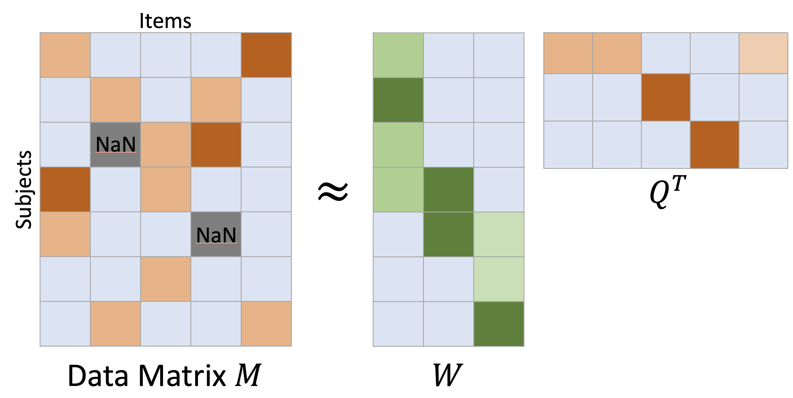
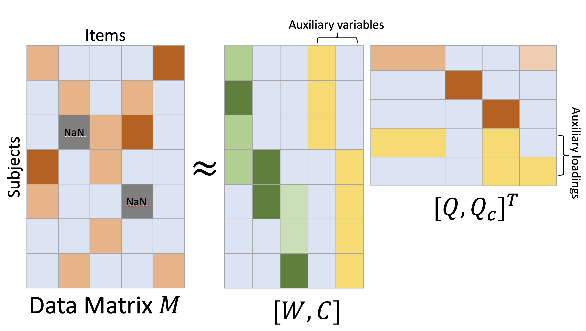
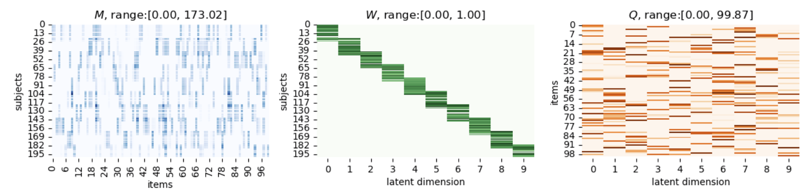
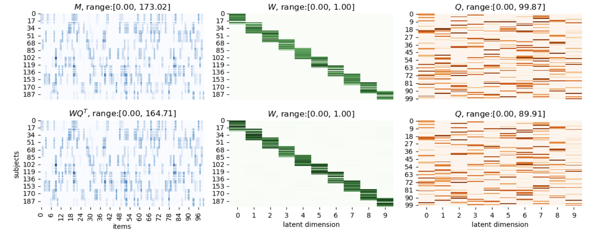
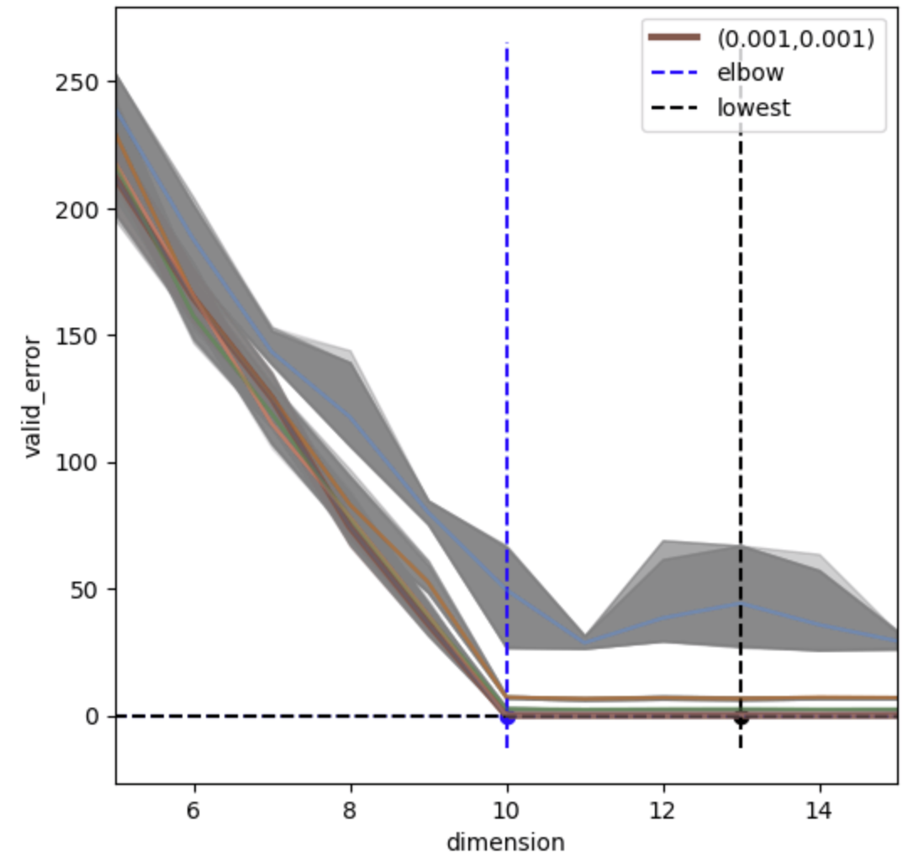

# ICQF (beta version)
beta version (0.0-b.1) for ICQF package

### What is ICQF

---

**ICQF** stands for <u>**I**nterpretability **C**onstrained **Q**uestionnaire **F**actorization</u>. 

It is a matrix decomposition algorithm designed for questionnaire dataset. Given a matrix $M$ storing questionnaire responses (#subjects $\times$ #question items), ICQF decomposes $M$ into $M \approx WQ^T$:



#### Who to try?

You may try ICQF if you wish to:

- perform exploratory matrix analysis with **<u>more interpretable</u>** outcomes
- perform tabular data analysis **<u>fully automatically</u>** in a data-driven way
- perform dimension reduction for non-negative tabular data, where **<u>auxiliary variables</u>** should be incorporated
- work on research development and you are looking for a module-based python implementation
- [coming soon] analyze **<u>multiple questionnaires</u>** simultaneously, where subject lists from questionnaires are partially overlapped.

#### ICQF

- is provably **convergent** with minimal hyper-parameters selection
- focuses on the **interpretabiltiy** of $W$, $Q$, which is enhanced via **(i)** sparsity control; **(ii)** constraining non-negativity of $W, Q$; **(iii)** constraining the range of $W, Q$ &  $(WQ^T)$ entries
- is designed for, but not limited to, **questionnaire** dataset

#### It supports*

- imputation (missing entries in $M$)

- bounded constraints on entries of $W$, $Q$ and the reconstructed matrix $WQ^T$

- regularization on $W$ and $Q$ (sparsity and smoothness)

- automatic detection of optimal latent dimension (dimension of $W, Q$)

- automatic detection of regularization strength

- inclusion of auxiliary variables $C$ (or confound controlling)

  > Auxiliary variables ($C$) are known variables to which the variable of interest ($W$) is approximately related. Examples of auxiliary variables such as Age, Sex of subjects, can be modeled by ICQF during the decomposition.



### Getting start

---

#### Installation

The required packages are recored in `environment.yml` file. Run the following command line in terminal to setup a new conda environment `ICQF`:

```
conda env create -f environment.yml
```

One may use `mamba` instead to create the `ICQF` environment

```
mamba env create -f environment.yml
```

### Quick Example

---

We first generate an synthetic example using `simulation` function from `util.generate_synthetic`:

```python
true_W, true_Q, _, M_clean, M, _ = simulation(200, 100)
```



The generated tabular data matrix $M$ has dimension $200 \times 100$ ($200$ subjects answering $100$ questions) and the intrinsic latent diemnsion is $10$.  The matrix $W$ and $Q$ are often called the {**latent factors**, **subject embedding**} and respectively,  {**factor loadings**, **question embedding**}, of the synthetic questionnaire $M$.

We first construct a dataclass object `matrix_class` to store data matrix $M$:

```python
MF_data = matrix_class(M=M)
```

which automatically perform the following:

- Check -- existence of NaN entries -- If `True`, create `nan_mask` matrix identifying the location of NaN entries
- Check -- existence of negative entries -- If `True`, map the entries to $0$
- [optional, if auxiliary variables are given]
  Check -- existence of NaN entries -- If `True`, perform simple imputation to fill the missing entries in the given auxiliary variables `confound`.
- [optional, if auxiliary variables are given]
  Translate & rescale the `confound` to $[0,1]$ range.

To factorize for $M$, we initialize a ICQF model with [optional] bounded constraints on $W$ [`W_upperbd=(True, 1.0)`], $Q$ [`Q_upperbd=(True, 100)`] and the reconstructed matrix $M$ [`M_upperbd=(True, np.max(MF_data.M))`]. We set the latent dimension = 10 with `n_components`: 

```python
clf = ICQF(n_components=10,
           W_upperbd=(True, 1.0),
           Q_upperbd=(True, 100),
           M_upperbd=(True, np.max(MF_data.M))
          )
```

After initializing the model, we can perform ICQF by

```python
MF_data, loss = clf.fit_transform(MF_data)
```

The matrix factorization results can be accessed via

```python
W = MF_data.W
Q = MF_data.Q
```

Qualitatively, we can compare with the ground-truth by visualizing them using `show_synthetic_result` function:

```
show_synthetic_result(MF_data, true_W, true_Q)
```



### Automatic configuration detection

---

If you are uncertain about the appropriate latent dimension (`n_components`) and/or the strength of regularization, you can conveniently set `n_components=None`. In such cases, ICQF will internally execute the function `detect_dimension` to automatically identify the optimal latent dimension and the corresponding regularization strength.

```python
clf = ICQF(n_components=None,
           W_upperbd=(True, 1.0),
           Q_upperbd=(True, 100),
           M_upperbd=(True, np.max(MF_data.M))
          )
MF_data, loss = clf.fit_transform(MF_data)
```

After the detection, the profile of the blockwise cross-validation will be visualized:



The elbows of the reconstruction error indicate that the optimal configuration would be 

- latent dimension = 10
- $L_1$ regularization strength for $W$ and $Q$ : (0.001, 0.001)


### Links

---

For more examples, please visit [Example](./EXAMPLE.md) and the [jupyter notebook](./demonstration.ipynb).

For the full documentation of the python module ICQF, please visit [Documentation](./DOCUMENTATION.md).


### Reference

