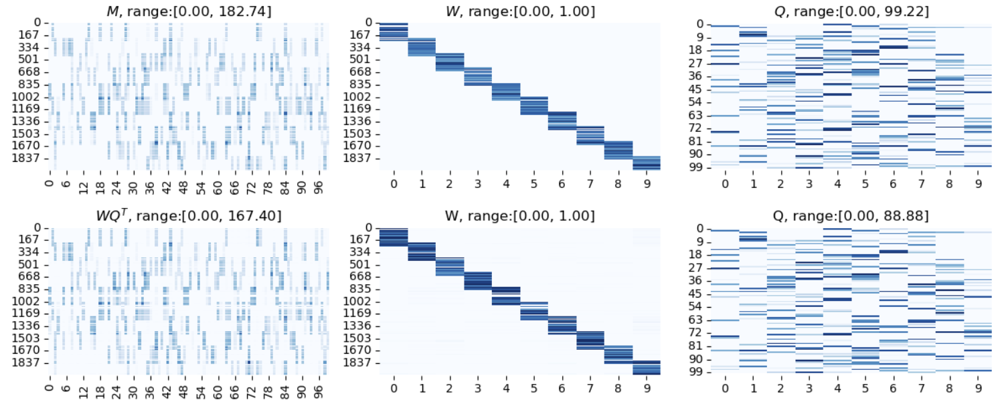
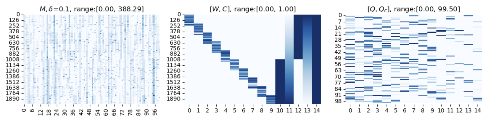
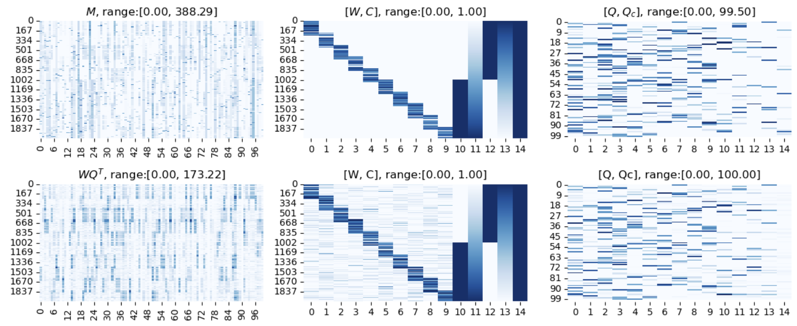
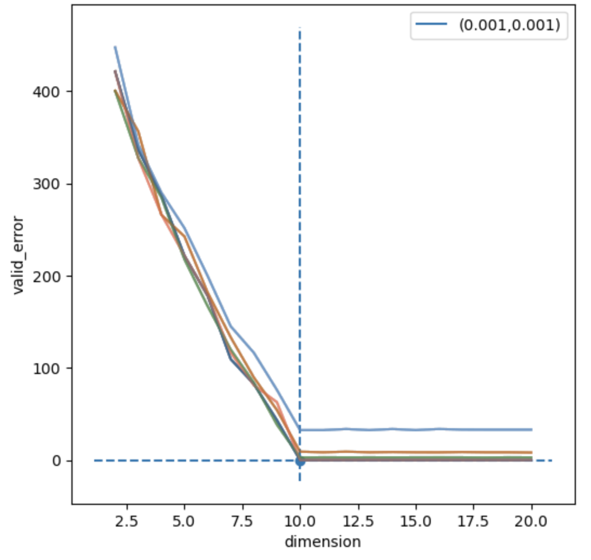

# ICQF_beta
closed beta version for ICQF package

### Getting start

##### Installation

The required packages are recored in `environment.yml` file. Run the following command line in terminal to setup a new conda environment `ICQF`:

```
mamba env create -f environment.yml
```


### Quick Example

We first generate an synthetic example using `simulation` function from `util.generate_synthetic`:

```python
true_W, true_Q, _, M_clean, M, _ = simulation(200, 100, 10)
```

The generated matrix has dimension $200 \times 100$ and the intrinsic latent diemnsion is 10.

Given the data matrix `M`, we first construct the data class,

```python
MF_data = matrix_class(M=M)
```

check inputs,

```python
MF_data.check_input()
```

and initialize the ICQF model:

```python
clf = ICQF(n_components=10,
           W_upperbd=(True, 1.0),
           M_upperbd=(True, np.max(MF_data.M)),
           Q_upperbd=(True, 100)
          )
```

ICQF is performed by

```MF_data, loss = clf.fit_transform(MF_data)```

The matrix factorization results can be accessed via

```python
W = MF_data.W
Q = MF_data.Q
```

Qualitatively, we can compare with the ground-truth by showing them in parallel

```
show_synthetic_result(MF_data, true_W, true_Q)
```




#### Data class

We store the data matrix as a customized `matrix_class` with the following input attributes:

- `M_raw` : the input data matrix.
- `M` : the processed data matrix
- `nan_mask` : an indicator matrix representing the availability of entries (=1) and missing entries (=0)
- `confound_raw` : [optional] the input confound matrix 
- `confound` : [optional] the processed confound matrix, columns are either one-hot encoded / rescaled to $[0, 1]$
- `dataname` : dataset name
- `itemlist` : unique keys for item (column ID)
- `subjlist` : unique keys for subject (row ID)

Given a data matrix `M_raw` with indicator mask matrix `nan_mask` and confound matrix `confound_raw` , we can run the following code to initialize the data class:

```python
MF_data = matrix_class(M_raw=M_raw, confound_raw=confound_raw, nan_mask=nan_mask)
```


#### Parameters

- `n_components` : **int, default=2** latent dimension. To estimate, see `detect_dim` in **Methods** section.
- `method` : **{'admm', 'cd', 'hybrid'}, default='cd'**. Method used to optimize `W` and `Q` subproblems.
- `W_beta` : **float, default=0.0**. Strength of regularizer on `W`. Set it to zero to have no regularization.
- `Q_beta` : **float, default=0.0**. Strength of regularizer on `Q`. Set it to zero to have no regularization
- `regularizer` : **{1, 2}, default=1**. Type of regularizer. For L-1 (sparsity) choose `1`. For L-2 (smoothness), choose `2`.
- `rho` : **float, default=3.0**. Penalty parameter. The larger the `rho`, the faster it converges to local minimum. A smaller `rho` often gives a better local minimum. Theoretically, $\rho \geq \sqrt{2}$ to guarantee convergnence.
- `tau` : **float, default=3.0**. Penalty parameter for **`method`='admm'**.
- `W_upperbd` : **tuple, default=(True, 1.0)**. Used for constraining the upper bound of entries of `W`. If the first entry of the tuple is `True`, the optimized `W` is bounded above by the second entry of the tuple. Default upper bound for `W` is 1.0. If the first entry of the tuple is `False`, no upper bound on `W` is introduced and the second entry is ignored.
- `Q_upperbd` : **tuple, default=(False, 1.0)**. Used for constraining the upper bound of entries of `Q`. If the first entry of the tuple is `True`, the optimized `Q` is bounded above by the second entry of the tuple. If the first entry of the tuple is `False`, no upper bound on `Q` is introduced and the second entry is ignored.
- `M_upperbd` : **tuple, default=(True, 1.0)**. Used for constraining the upper bound of entries of `M`. If the first entry of the tuple is `True`, the optimized `M` is bounded above by the second entry of the tuple. If the first entry of the tuple is `False`, no upper bound on `M` is introduced and the second entry is ignored.
- `min_iter` : **int, default=10**. Minimum number of iteration..
- `max_iter` : **int, default=200**. Maximum number of itererations.
- `admm_iter` : **int, default=5**. Number of ADMM iterations if `method`='hybrid' is used. For more details on the 'hybrid' solver, see **Methods** section.
- `tol` : **float, default 1e-4**. Tolerance of the stopping criterion (relative error between successive iteration ).
- `verbose` : **int, default=0**. Whether to be verbose.

#### Attributes

- `n_components_` : **int**. Latent dimension. If the latent dimensino was initially given, it will be the same as the `n_components`. otherwise, it will be the dimension detected using `detect_dimension` method.
- `loss_history_` : **list**. Trend of the objective loss during model training.

#### Methods

- `fit(matrix_class, svd_components=None)` : Learn an ICQF model for the data stored as `matrix_class`. An SVD initialization can be provided via the `svd_components`, which is a tuple with two components. `svd_component[0]` and `svd_component[1]` correspond to the $S$ and $V^T$ of an SVD decomposition $USV^T$.
- `fit_transform(matrix_class, svd_components=None)` :  Learn an ICQF model for the data stored as `matrix_class` and return the transformed data stored in the input `matrix_class` object.
- `transform(matrix_class)` : Transform a data stored as `matrix_class` according to the fitted model. Specifically, the matrix `matrix_class.Q` (and if available `matrix_class.Qc`) is fixed during the transform.
- `detect_dimension(matrix_class, dimension_list=None, W_beta_list=None, Q_beta_list=None, mask_type='random', repeat=5, nfold=10, random_fold=True, nrow=10, ncol=10)` : Detect the optimal configuration of latent dimension and regularization strength via blockwise cross validation. 
  - `dimension_list` : **list[int], default=None**. List of integers to test for optimal latent dimension. If `None`, an automatic estimation of dimension $d$ using parallel analysis is performed and test the optimal dimension within the range $[ \max(d-10, 2), d+10]$.
  - `W_beta_list` : **list[float], default=None**. List of floats to test for optimal regularization strength. If `None`, it tests the optimal regularization for $W$ within $[0.0, 0.01, 0.1, 0.2, 0.5]$.
  - `Q_beta_list` : **list[float], default=None**. List of floats to test for optimal regularization strength. If `None`, it tests the optimal regularization for $Q$ within $[0.0, 0.01, 0.1, 0.2, 0.5]$.
  - `mask_type` : **{'random', 'block'}, default='random'**. Ways to choose the sub-block matrix for cross validation. If `random`, `1/nfold` of entries will be choose random within the whole matrix as the cross-validation held-out set. If `block`, the data matrix will first be subdivided into `nrow` $\times$ `ncol` sub-blocks, then $\lfloor$ `nrow` $\times$ `ncol` / `nfold`  $\rfloor$ sub-blocks will be chosen as the cross-validation held-out set.
  - `repeat` : **int, default=1**. Number of cross-validation for each configuration.
  - `nfold` : **int, default=5**. Number of folds in cross-validation.
  - `random_fold` : **boolean, default=True**. If `True`, only one random fold will be selected in each cross validation. The aim is to massively reduce the computation time. The optimal configuration tested under this setting serves as a rough estimation only. Used in care. If `False`, validation errors for each fold will be computed, yet the computation cost will be multiplied by `nfold`.
  - `detection` : **{'kneed', 'lowest'}, default='kneed'**. Way to detect the optimal dimension. `'kneed'` uses the kneed algorithm to detect the changing point, via `'lowest'` simply look for the configuration achieving lowest, averaged cross-validation error. `'kneed'` is recommended.
  - `nrow` : **int, default=10**. Used for `mask_type='block'`. The data matrix will be divided into `nrow` blocks (first dimension).
  - `ncol` : **int, default=10**. Used for `mask_type='block'`. The data matrix will be divided into `ncol` blocks (second dimension).
  - `show_profile` : **boolean, default=True**. If `True`, a plot showing the trends of cross-validation error in different configurations will be generated.


#### Solvers:

Numerical solver to use for solving the subproblems. For `regularizer`=1, the `W` and `Q` subproblems become (constrained) LASSO problems. For `regularizer`=2, the `W` and `Q` subproblems become (constrained) quadratic programming.

- **‘admm’** : ADMM algorithm to solve the subproblems.
- **‘cd’** : coordinate descent to solve the subproblems.
- **‘hybrid’** : it utilizes a hybrid approach to address the subproblems. Initially, the solver operates similarly to the **'admm'** solver for the first `admm_iter` iterations. Subsequently, the **'cd'** algorithm is executed until the stopping criterion is met. This hybrid approach aims to prevent convergence to local minima while ensuring computational efficiency.


### Examples

#### Synthetic example with confounds

Using the `simulation` function in `utils.generate_synthetic`, we can generate a synthetic example with confounds containing categorical and continuous variables (mimicing gender and age confounds)

```python
from src.data_class import matrix_class
from src.ICQF import ICQF
from utils.generate_synthetic import simulation, show_synthetic_result

true_W, true_Q, confound_raw, M_clean, M, _ = simulation(2000, 100, 10, 50, density=0.3,
                                                         noise=True, delta=0.1, 
                                                         confound=True,
                                                         visualize=True)
```

Instead of `None` in the **Quick example**, `confound_raw` is a $2000 \times 2$ matrix storing the categorical (first column) and continuous (second column) confounds:

```python
print(np.around(confound_raw,3))
[[0.    0.   ]
 [0.    0.001]
 [0.    0.001]
 ...
 [1.    0.999]
 [1.    0.999]
 [1.    1.   ]]
```





> The function `simulation` generates both the `confound_raw` and the matrix $C$ based on the following rules:
>
> - If the $j^{\text{th}}$ column `confound_raw`$_{[:,j]}$ is categorical, we convert it to indicator columns for each value (we have two categories in this example). The transformed columns are `10` and `12` respectively in the middle panel of the above figure. 
> - If it is continuous, we first rescale it into $[0, 1]$ (where 0 and 1 are the minimum and maximum in the dataset), and replace it with two new columns, $C_{[:,j]}$ and $1 - C_{[:,j]}$. This mirroring procedure ensures that both directions of the confounding variables are considered (e.g. answer patterns more common the younger or the older the participants are). the transformed columns are `11` and `13` respectively in the middle panel of the above figure.
>
> Lastly, we incorporate a vector of ones into $C$ to facilitate intercept modeling of dataset wide answer patterns, which is the `14` column in the middle panel of the above figure.


Similarly, we construct the corresponding `matrix_class` object storing the data.

```python
MF_data = matrix_class(M=M, confound_raw=confound_raw)
MF_data.check_input()
```

Then we setup the ICQF model:

```python
clf = ICQF(n_components=10,
           W_beta=0.1,
           Q_beta=0.1,
           W_upperbd=(True, 1.0),
           M_upperbd=(True, np.max(MF_data.M)),
           Q_upperbd=(True, 100),
           method='cd', max_iter=2000, min_iter=10, tol=1e-6, verbose=True)
```

and fit and transform the data matrix:

```
MF_data, loss = clf.fit_transform(MF_data)
```

We then compare with the ground-truth results qualitatively:

```
show_synthetic_result(MF_data, true_W, true_Q)
```




#### Synthetic example with missing entries

In this example, we generate another example with missing entries. We can set the missing ratio via `missing_ratio`:

```python
true_W, true_Q, confound_raw, M_clean, M, nan_mask = simulation(2000, 100, 10, 50, 
                                                                density=0.3,
                                                                noise=True,
                                                                delta=0.1, 
                                                                confound=True,
                                                                missing_ratio=0.05,
                                                                visualize=True)
```

We include `nan_mask` to the `matrix_class`:

```
MF_data = matrix_class(M=M, confound_raw=confound_raw, nan_mask=nan_mask)
MF_data.check_input()
```

and fit and transform as usual:

```
MF_data, loss = clf.fit_transform(MF_data)
```


#### Configuration detection

Very often the latent dimension is not know a-priori, not to mention the strength of regularizers. For users who wish to explore the dataset automatically, the function `detect_dimension` can be utilized to estimate the optimal, data-driven configuration via block cross-validation.

We first generate a simple example

```python
true_W, true_Q, _, M_clean, M, _ = simulation(200, 100, 10)
MF_data = matrix_class(M=M)
MF_data.check_input()
```

We then use the `detect_dimension` function

```python
optimal_MF_data, optimal_stat, embed_stat_list = clf.detect_dimension(MF_data,repeat=1)
```

and obtain the full profile `embed_stat_list`



Here the optimal configuration detected is dimension=10, $\beta_W = 0.001$, $\beta_Q = 0.001$.

#### Synthetic CBCL questionnaire example


### Supports


### 


### ICQF

##### Main inputs

Consider a questionnaire data matrix $M \in \mathbb{R}_{\geq 0}^{n \times m}$ with $n$ participants and $m$ questions, where entry $(i,j)$ is the answer given by participant $i$ to question $j$. 

As questionnaires often have missing data, we also have a mask matrix  $\mathcal{M} \in \{0, 1\}^{n \times m}$ of the same dimensionality as $M$, indicating whether each entry is available $(=1)$ or not $(=0)$. 

##### Confounds

Optionally, we may have a confounder matrix  $C \in \mathbb{R}_{\geq 0}^{n \times c}$, encoding $c$ known variables for each participant that could account for correlations across questions (e.g. age or sex). 

- If the $j^{th}$ confound $C_{[:,j]}$ is categorical, we convert it to indicator columns for each value. 
- If it is continuous, we first rescale it into $[0, 1]$ (where 0 and 1 are the minimum and maximum in the dataset), and replace it with two new columns, $C_{[:,j]}$ and $1 - C_{[:,j]}$. This mirroring procedure ensures that both directions of the confounding variables are considered (e.g. answer patterns more common the younger or the older the participants are). 

Lastly, we incorporate a vector of ones into $C$ to facilitate intercept modeling of dataset wide answer patterns.

##### Factorization model

We seek to factorize the questionnaire matrix $M$ as the product of a $n \times k$ factor matrix $W \in [0,1]$, with the confound matrix $C \in [0,1]$ as optional additional columns, and a $m \times (k+c)$ loading matrix $Q := [Q_R, Q_C]$, with a loading pattern $Q_R$ over $m$ questions for each of the $k$ factors (and $Q_C$ for optional confounds). Our problem optimizes for $W, Q$: 

$$ 1/2 \Vert \mathcal{M} \odot (M - Z) \Vert_F^2 + \beta \cdot R(W, Q) $$

such that

- $[W, C] Q^{T} = Z,$
- $\text{min}(M) \leq Z_{ij} \leq \text{max}(M)$
- $0 \leq Q_{ij} \leq Q_{bd}$ 
- $0 \leq W_{ij} \leq W_{bd}$

for some optional upper bounds $Q_{bd}, W_{bd}$ for $Q$ and $W$ respectively. The regularizer $R$ is defined as

$$R(W, Q) := \Vert W \Vert_{p, q} + \gamma \Vert Q \Vert_{p, q}$$

with $\gamma = \frac{n}{m}\max(M)$. The matrix norm is defined as $\Vert A \Vert_{p, q} := ( \sum^m_{i=1} ( \sum^n_{j=1} |A_{ij}|^p )^{q/p} )^{1/q}$. 

In this package, $p=q=\{1,2\}$ for the $L_1$ and $L_2$ regularization.


### Reference

