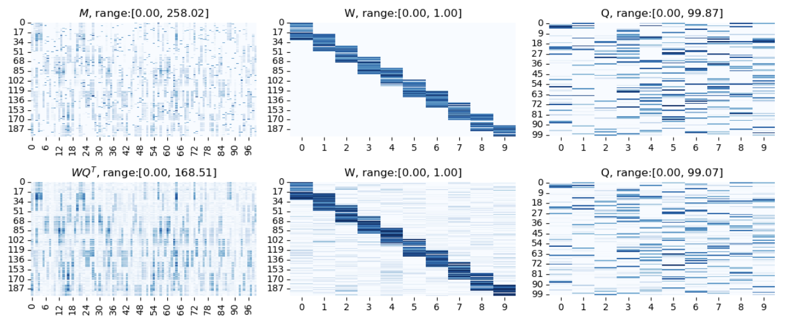

# ICQF
Implementation of Interpretability Constrained Questionnaire Factorization

### Prerequisites
The `environment.yml` records all libraries used to reproduce the environment.

### Getting start

`synthetic_questionnaire.ipynb` serves as a standalone demonstration the ICQF applied on a synthetic questionnaire. 

We simulate a $200 \times 100$ data matrix with intrinsic dimension 10. Noise is added with $\delta = 0.1$. Denote the data matrix by $M$. Suppose all entries in $M$ are available, the mask matrix $\mathcal{M}$ will be of the same size as $M$, and with all ones. To perform ICQF, we simply import the function

```python
from src.MF_algorithm import MF_model
```

and run

```python
model = MF_model(M, # The data matrix
                 np.ones_like(M), # mask matrix indicating availability of entries
                 10, # dimension / number of latent factors
                 regularizer=1, # L-1 or L-2 regularizer
                 W_upperbd=(True, 1.0), # upper bound for W, (False, 0) = no constraint
                 Q_upperbd=(True, 100.0), # upper bound for Q
                 M_upperbd=(True, np.max(M)), # upper bound for the reconstruct matrix
                 W_beta=0.1, Q_beta=0.1) # regularizer parameter
MF_data = model.decomposition()
```

Resultant $W$ and $Q$ can be access by calling `MF_data.W` and `MF_data.Q` respectively. Figure below visualize the factorization result of the synthetic example obtained by ICQF (top row: ground-truth, bottom row: factorization estimation).



`BCV.py` contains the implementation of Blockwise Cross-Validation) which is used for detecting optimal number of latent factors. We use the function `BCV.py` to run `MF_model.py` under different configuration (dimension, $\beta_W$ and $\beta_Q$) for hyperparameter optimization. In this demonstration, optimal setting is used. For `BCV.py`, as it runs `MF_model.py` multiple times, we recommend running it as batch jobs.

### Remark

- Given that both HBN and ABCD dataset require the acceptance of user agreement, we are not allowed to share both raw and pre-processed data directly.
- To reproduce the results reported in the manuscript, data should be downloaded and preprocessed ahead of running the code. Please visit https://healthybrainnetwork.org/ and https://abcdstudy.org/ for more information on requesting the data. Nevertheless, the preprocessing demonstration on CBCL-HBN questionnaire can be found in `/data/HBN/HBN_loaders/CBCL.ipynb`. Different questionnaires in HBN dataset can be processed similarly. As subjects responding to different questionnaires are partially overlapped, we also provide an illustration on how multiple questionnaires should be concatenated, see `/data/HBN/HBN_merge_questionnaires.ipynb` for more information.


### Model evaluation on CBCL-HBN questionnaire
In the following, we use HBN dataset as an example for instruction. CBCL-ABCD can also be performed similarly using `CBCL-ABCD_factorize.py` and `CBCL-ABCD_evaluate.py`.

1. Obtain the following questionnaire information (filename may vary, depends on data version)
  - basic demographic information (`./data/HBN/9994_Basic_Demos_20210310.csv`)
  - subject's diagnostic label (`./data/HBN/HBN_participantDx.csv`)
  - question information (`./data/HBN/CBCL2001_item_variables_fixed.csv`)
  - question responses (`./data/HBN/9994_CBCL_20210310.csv`)

2. Process the information as demonstrated in `./data/HBN/HBN_loaders/CBCL.ipynb`.

3. Run `CBCL-HBN_facroize.py` for both model training and model inference.

4. Evaluate the model with `CBCL-HBN_evaluate.py`.

